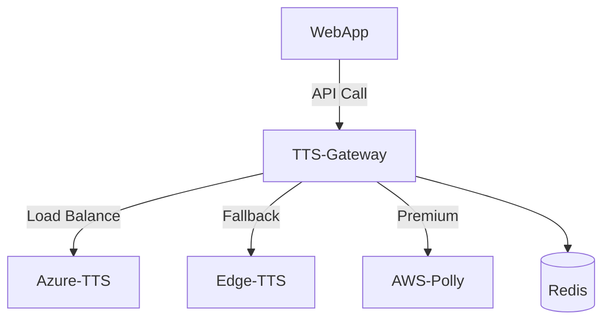

# 🎤 TTS Gateway - Multi-Platform Text-to-Speech Orchestration

[](https://fastapi.tiangolo.com)
[](https://react.dev)
[](https://azure.microsoft.com/en-us/products/cognitive-services/text-to-speech)

A unified gateway for cloud-based text-to-speech services with intelligent routing and enterprise-grade features.

## ✨ Core Features

### Multi-Cloud Support
| Platform      | Status     | Features                          |
|---------------|------------|-----------------------------------|
| Azure Cognitive | ✅ Live    | Neural Voices, SSML, Real-time    |
| Edge-TTS      | ✅ Live    | Free Tier, 20+ Voices             |
| AWS Polly     | 🚧 Beta    | Neural & Standard Voices          |
| Google Cloud  | 🚧 Planned | WaveNet Voices                    |

### Technical Highlights
- **Smart Routing**: Auto-select optimal TTS engine based on cost/language
- **Real-time Streaming**: Low-latency audio delivery (MP3/WAV)
- **Enterprise Ready**:
  - Full request tracing (X-Request-ID)
  - Structured logging with request context
  - Automated temp file cleanup

## 🛠️ Architecture



## 🚀 Quick Start

### Backend Setup
```bash
# Install dependencies
pip install -r requirements.txt

# Configure environment
cp .env.example .env

# Start service (dev)
uvicorn backend.main:app --reload
```

### Frontend Setup
```bash
cd frontend
npm install
npm start
```

## 🌐 API Documentation

### Generate Speech
```python:backend/routers/tts_router.py
startLine: 9
endLine: 18
```

**Request Example:**
```bash
curl -X POST "https://YOUR_DOMAIN/api/generate" \
  -H "Content-Type: application/json" \
  -d '{
    "text": "Welcome to TTS Gateway",
    "voice": "en-US-JennyNeural",
    "azure_key": "YOUR_KEY",
    "azure_region": "eastus"
  }'
```

## 🔮 Roadmap

### Q3 2024
- AWS Polly integration
- Audio post-processing pipeline
- Rate limiting

### Q4 2024
- Google Cloud TTS support
- Multi-tenant architecture
- Voice cloning API

## 🌍 Deployment

### PythonAnywhere Config
```python:backend/main.py
startLine: 38
endLine: 45
```

### Vercel Frontend
Set environment variables:
```javascript:frontend/src/config.js
startLine: 1
endLine: 7
```

## 🤝 Contribution
See [CONTRIBUTING.md](CONTRIBUTING.md) for development setup and guidelines.

---

🐛 [Report Issue](https://github.com/Kuxry/text-to-speech-bot/issues)


